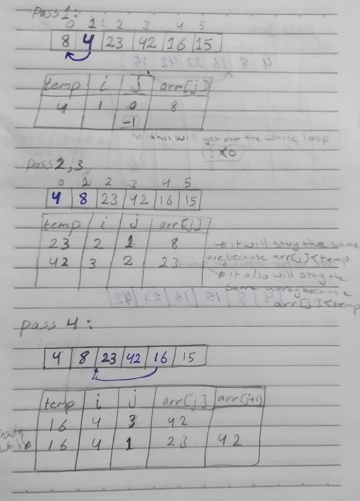
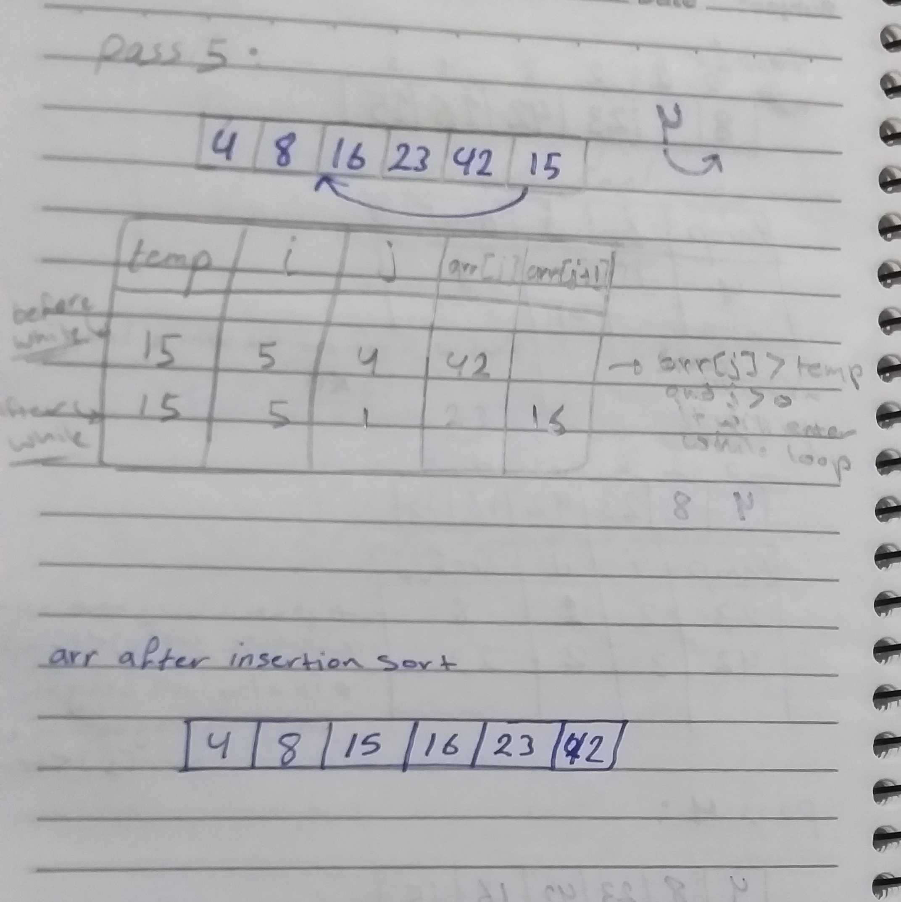

# Insertion Sort 
Insertion sort is the sorting mechanism where the sorted array is built having one item at a time. The array elements are compared with each other sequentially and then arranged simultaneously in some particular order.

## Pseudocode :

  InsertionSort(int[] arr)
  
    FOR i = 1 to arr.length
    
      int j <-- i - 1
      int temp <-- arr[i]
      
      WHILE j >= 0 AND temp < arr[j]
        arr[j + 1] <-- arr[j]
        j <-- j - 1
        
      arr[j + 1] <-- temp
       

## Trace :

Sample Array : [8,4,23,42,16,15] 

## Efficency :

I need to  implement an Insertion Sort a while loop within a for loop; the for loop iterated over the entire array, the while loop only ran if the current item was less than the item prior.

 Time: O(n^2)

The basic operation of this algorithm is comparison. This will happen n * (n-1) number of times…concluding the algorithm to be n squared.

 Space: O(1)

No additional space is being created. This array is being sorted in place…keeping the space at constant O(1).

